# 🖥️ Comsy – Computer Lab Management System

**Comsy** is a full‑stack web application built to streamline the reporting, tracking, and management of technical issues inside college computer labs. It focuses on role‑based access, real‑time updates, and an offline LAN mode via Electron so labs remain functional without internet.

---

[](#) [](LICENSE) [](#)

---

## Table of Contents

1. [Demo & Screenshots](#demo--screenshots)
2. [Features](#features)
3. [Tech Stack](#tech-stack)
4. [How It Works](#how-it-works)
5. [Project Structure](#project-structure)
6. [Setup & Installation](#setup--installation)
7. [Environment Variables](#environment-variables)
8. [Run / Development Commands](#run--development-commands)
9. [API Summary (examples)](#api-summary-examples)
10. [Tests & CI](#tests--ci)
11. [Contributing](#contributing)
12. [License](#license)
13. [Contact](#contact)

---

## Demo & Screenshots

> Tip: Add a short demo GIF (5–10s) showing a student reporting an issue and admin resolving it — place it at the top for maximum impact.

### Screenshots

<!-- these images are referenced from the `images/` folder in the repo -->

**Main Dashboard**

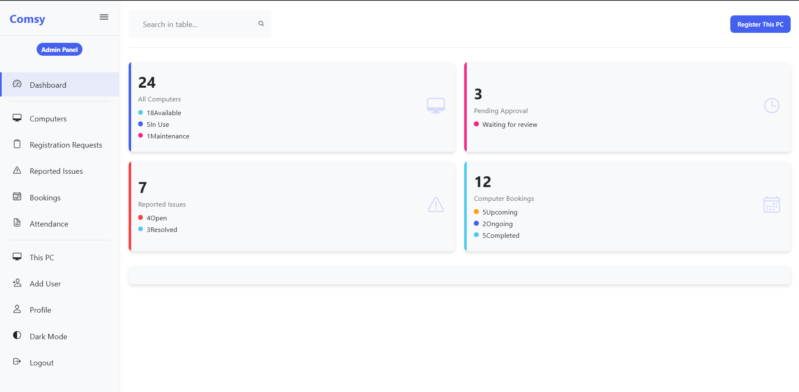

---

**Lab Computer List**

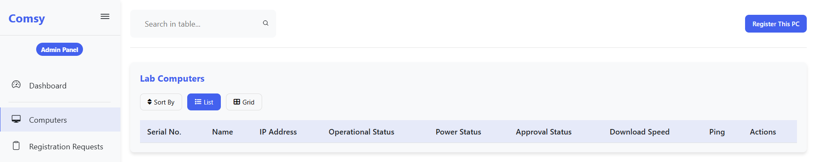

---

**Registration Requests**

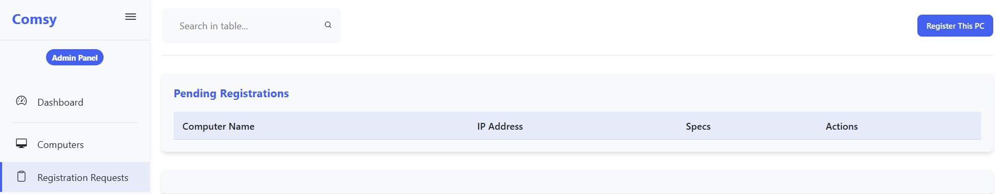

---

**Reported Issue View**

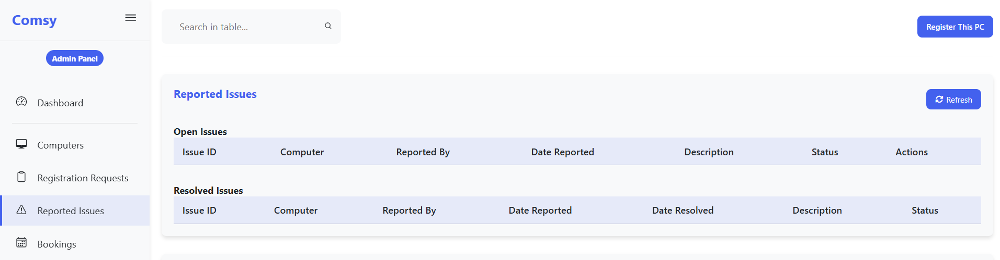

---

**Booking / Scheduling**

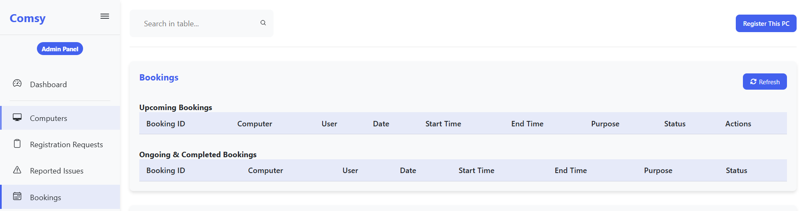

---

**Attendance**

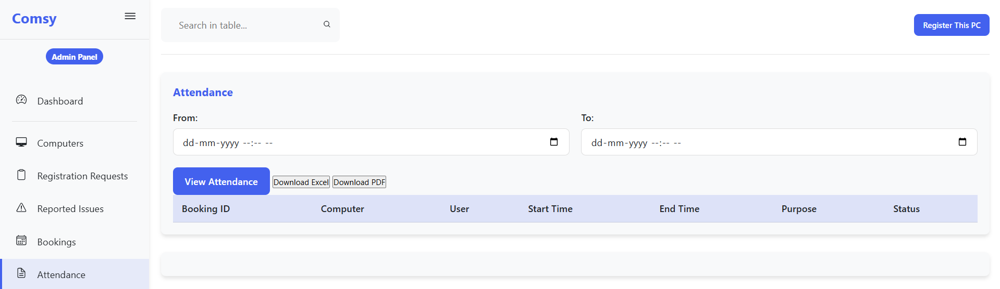

---

**Registration Details**

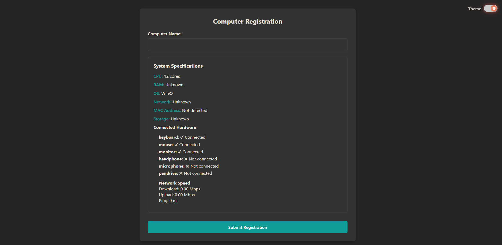

---

**Create New User**

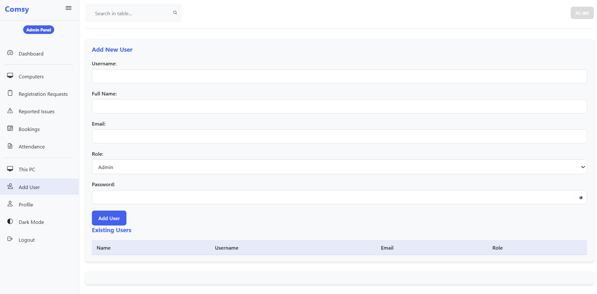

---

**Dark Mode**

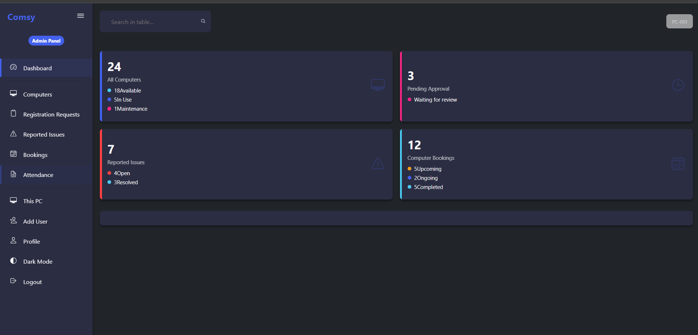

---

**Login Page**

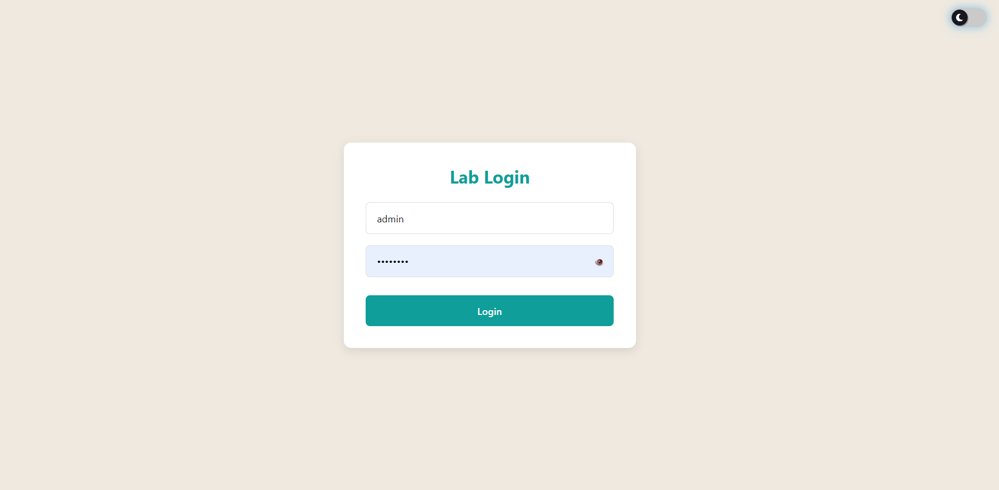

---

**Landing Page**

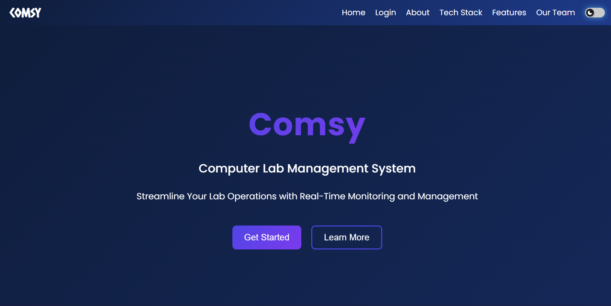

---

**About Page**

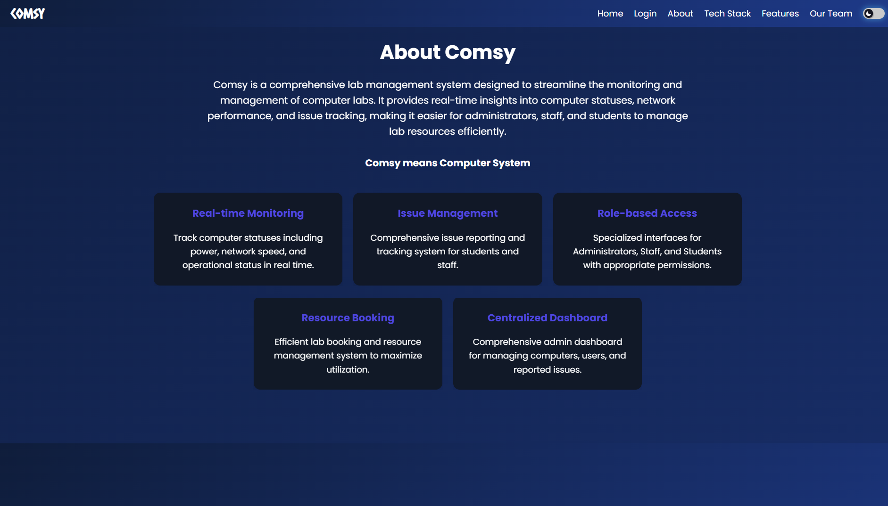

---

**Tech Stack Overview**

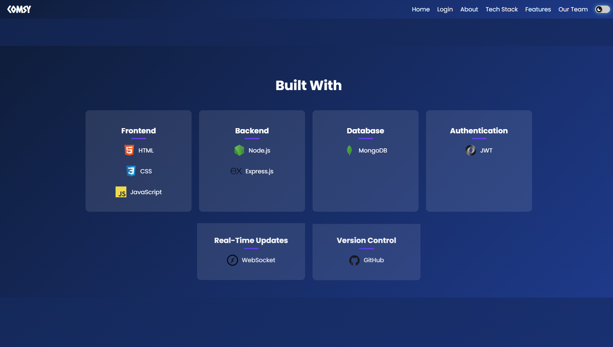

---

**Features Snapshot**

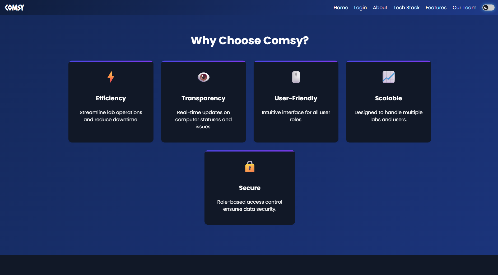

---

**Team**

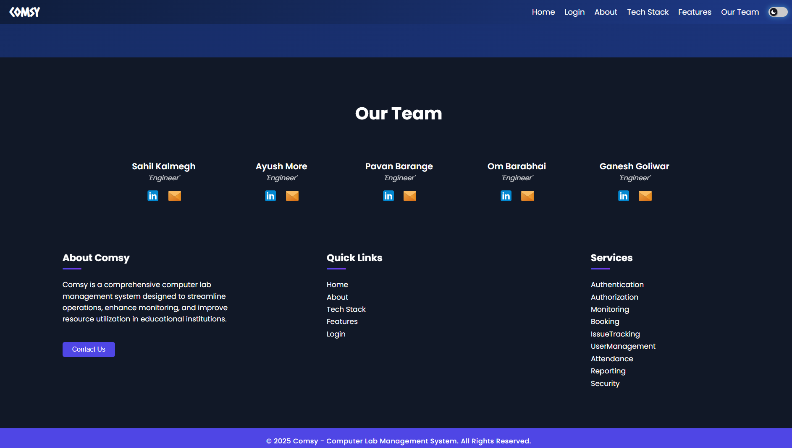

---

## Features

- 🧾 **Issue Reporting**: Students can report hardware and software problems with optional screenshots and lab/computer selection.
- 👨‍🏫 **Role-Based Dashboards**: Admin, Faculty and Student views with different permissions and actions.
- 🔐 **JWT Authentication**: Secure login with role-based access tokens and session handling.
- 🌐 **Real-Time Updates**: Live status updates through WebSockets (or short polling where applicable).
- 💾 **MongoDB**: Mongoose models persist users, issues, labs, attendance and bookings.
- 🖧 **Offline LAN Mode**: Electron app to run within local lab network without internet.
- 📊 **Admin Control Panel**: Filter, assign, and resolve issues; view analytics and logs.

## Tech Stack

**Frontend**

- HTML5, CSS3, JavaScript (vanilla) — simple modular UI (or optionally React)

**Backend**

- Node.js, Express.js
- JWT authentication middleware

**Database**

- MongoDB with Mongoose ODM

**Other**

- Electron.js (offline LAN wrapper)
- Git & GitHub, Postman for API testing

---

## How It Works

1. **Student** logs in and submits an issue choosing lab & computer and optionally attaching a screenshot.
2. **Faculty / Admin** receives the issue in their dashboard, assigns it to a technician or marks it in progress.
3. Status moves along: `Pending` → `In Progress` → `Resolved` (notifications / live updates are pushed to clients).
4. Data persists in MongoDB; Electron ensures the same flow works over LAN when the internet is unavailable.

---

## Project Structure (recommended)

```
COMSY-Computer-Lab-Management-System/
├── README.md
├── LICENSE
├── .gitignore
├── .env.example
├── images/
├── client/
│   ├── package.json
│   └── src/
├── server/
│   ├── package.json
│   └── src/
│       ├── index.js
│       ├── config/db.js
│       ├── models/
│       ├── controllers/
│       └── routes/
├── electron/
├── docs/
└── scripts/
```

---

## Setup & Installation

> Requirements: Node.js (v16+ recommended), npm or yarn, MongoDB (Atlas or local)

1. Clone the repo:

```bash
git clone https://github.com/<your-username>/COMSY-Computer-Lab-Management-System.git
cd COMSY-Computer-Lab-Management-System
```

2. Server setup

```bash
cd server
cp .env.example .env   # then edit .env with real values
npm install
npm run dev             # starts server (nodemon) on PORT from .env
```

3. Client setup (if separated)

```bash
cd client
npm install
npm run dev             # or open index.html if vanilla frontend
```

4. Electron (LAN app)

```bash
cd electron
npm install
npm run start
```

---

## Environment Variables

Create a `.env` file in `server/` using the example below:

```env
PORT=5000
MONGO_URI=mongodb+srv://<user>:<pass>@cluster0.mongodb.net/comsy?retryWrites=true&w=majority
JWT_SECRET=your_jwt_secret
CLIENT_URL=http://localhost:3000
```

> **Important:** Never commit your real `.env` to the repository. Keep `.env` in `.gitignore`.

---

## Run / Development Commands

Top-level `package.json` (optional) can orchestrate both client and server.

```bash
# From server/
npm run dev       # development server with nodemon
npm start         # production start

# From client/
npm run dev       # starts client dev server

# From electron/
npm run start     # runs electron app for LAN mode
```

---

## API Summary (examples)

> These are sample endpoints — adapt to your routes.

**Auth**

```bash
POST /api/auth/register  # register user
POST /api/auth/login     # login -> returns JWT
GET  /api/auth/me        # get current user (protected)
```

**Issues**

```bash
GET  /api/issues         # list issues (admin / filters)
POST /api/issues         # create issue (student)
GET  /api/issues/:id     # view a specific issue
PUT  /api/issues/:id     # update status/assign (protected)
```

**Users**

```bash
GET  /api/users          # list users (admin)
POST /api/users          # create new user (admin)
```

**Example: create issue (curl)**

```bash
curl -X POST http://localhost:5000/api/issues \
 -H "Authorization: Bearer <token>" \
 -H "Content-Type: application/json" \
 -d '{"labId":"LAB001","computerId":"PC03","title":"Monitor not working","description":"No display, power light on"}'
```

Add a Postman collection to `docs/` for easy testing and link it from the README.

---

## Tests & CI

Add basic tests and a GitHub Actions workflow in `.github/workflows/ci.yml` to run lint/tests on push/PRs. See `scripts/` for seeds like `createSuperAdmin.js`.

---

## Contributing

Contributions are welcome — please follow these steps:

1. Fork the repo
2. Create a feature branch: `git checkout -b feat/your-feature`
3. Commit changes: `git commit -m "feat: add ..."`
4. Push and open a Pull Request

Include meaningful commit messages and keep PRs focused.

---

## License

This project is licensed under the **MIT License** — see `LICENSE` for details.

---

## Contact

Your Name — \[[om.r.barabhai@email.com](mailto:om.r.barabhai@email.com)]

Project Link: `https://github.com/OmBarabhai/COMSY-Computer-Lab-Management-System`

---